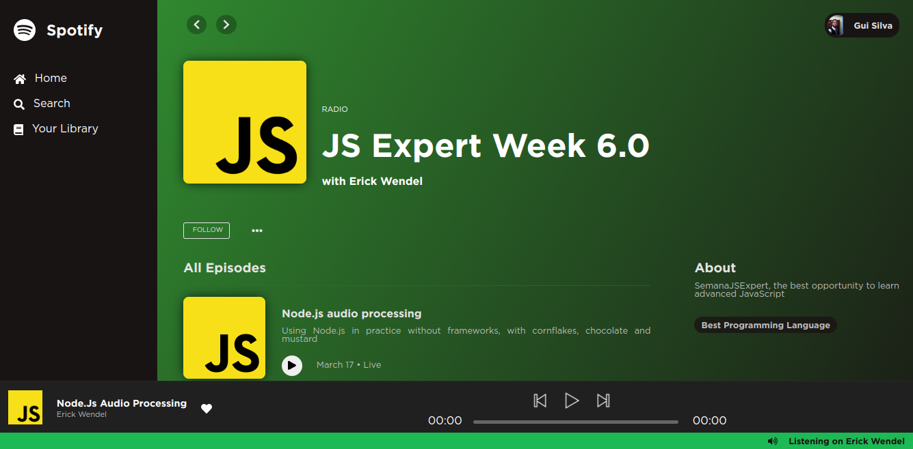
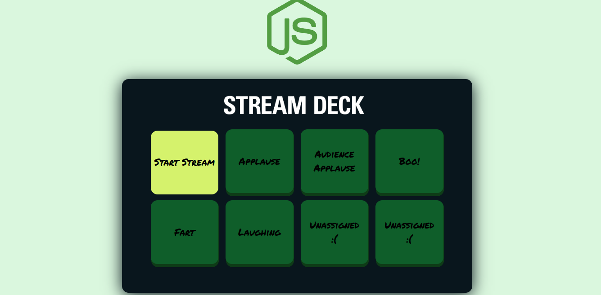

# Spotify Radio Clone

Seja bem vindo(a) à sexta Semana Javascript Expert. Este é o código inicial para
iniciar nossa jornada.

## Preview

### Créditos aos áudios usados

#### Transmissão

- [English Conversation](https://youtu.be/ytmMipczEI8)

#### Efeitos

- [Applause](https://youtu.be/mMn_aYpzpG0)
- [Applause Audience](https://youtu.be/3IC76o_lhFw)
- [Boo](https://youtu.be/rYAQN11a2Dc)
- [Fart](https://youtu.be/4PnUfYhbDDM)
- [Laugh](https://youtu.be/TZ90IUrMNCo)

## FAQ

- `NODE_OPTIONS` não é um comando reconhecido pelo sistema, o que fazer?
  - Se você estiver no Windows, a forma de criar variáveis de ambiente é
    diferente. Você deve usar a palavra `set` antes do comando.
  - Ex:
    `"test": "set NODE_OPTIONS=--experimental-vm-modules && npx jest --runInBand",`

- Rodei `npm test` mas nada acontece, o que fazer?
  - Verifique a versão do seu Node.js. Estamos usando na versão 17. Entre no
    [site do node.js](https://nodejs.org) e baixe a versão mais recente.
